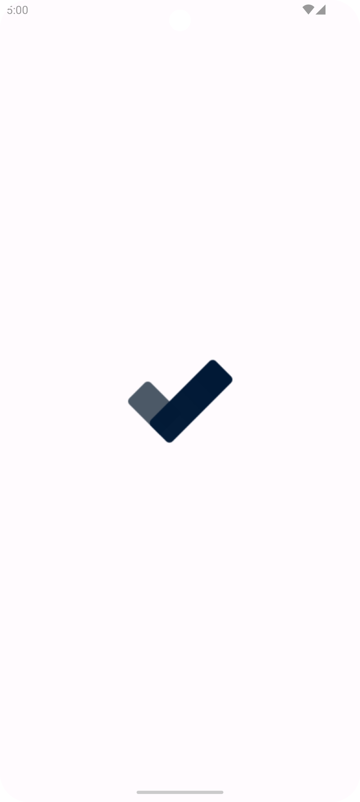
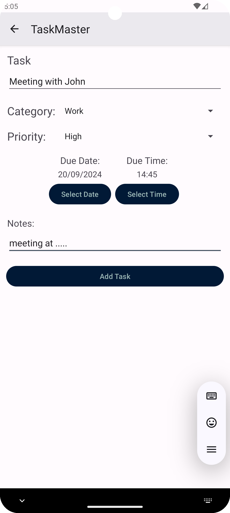
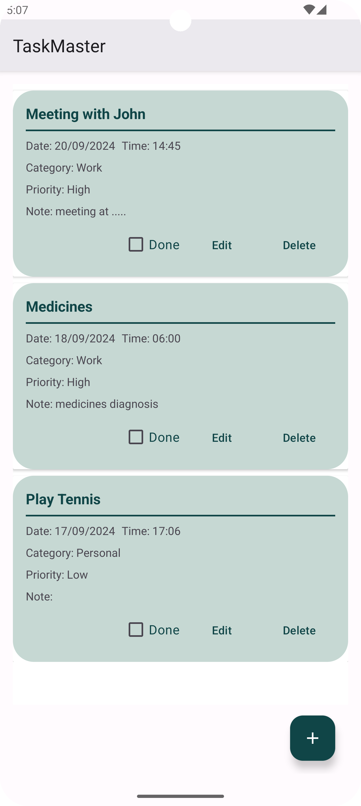

# To-Do List App

A simple and intuitive To-Do List app built with Android to help users manage their tasks efficiently. The app allows users to add, edit, and categorize tasks with due dates, priorities.

## Features

- Add, edit, and delete tasks
- Set due dates and prioritize tasks
- Organize tasks using categories and labels
- Mark tasks as complete or incomplete

## Screenshots

### Task List

### Add Task

### Task Details

